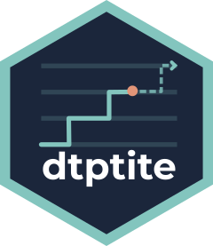

# dtptite 

an R package implementing dose transition for time-to-event dose-escalation study design

## Funding

Xiaoran Lai, NIHR Development and Skills Enhancement Award (DSE), NIHR500663, is
funded by the NIHR for this research project. The views expressed in this
publication are those of the author(s) and not necessarily those of the NIHR, NHS
or the UK Department of Health and Social Care.
